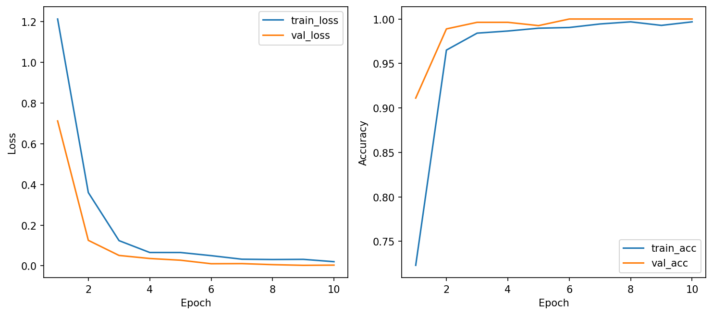
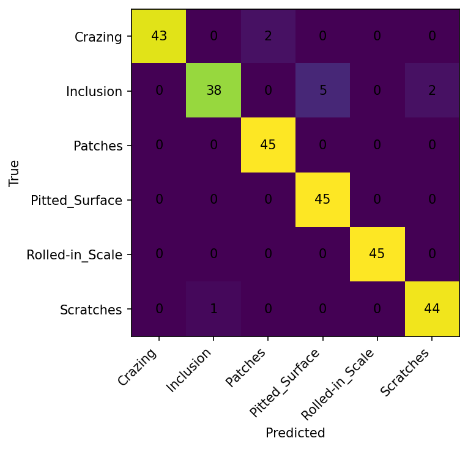
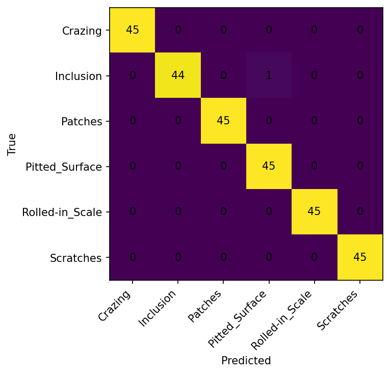
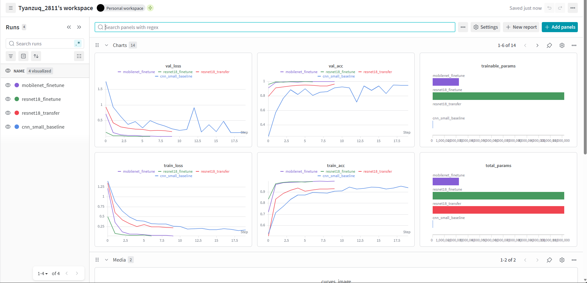

# CSC4005 – Lab 2 Report
# CNN Image Classification: From Scratch vs Transfer Learning

## 1. Thông tin chung
- **Họ và tên:** Lê Tuấn Dũng
- **Lớp:** KHMT 17-01
- **Repo:** https://github.com/Tyanzuq28/csc4005-lab2-cnn-neu-tyanzuq2811
- **W&B project:** [csc4005-lab2-neu-cnn](https://wandb.ai/models-dai-nam-university/csc4005-lab2-neu-cnn)

## 2. Bài toán

Bài toán phân loại ảnh lỗi bề mặt thép sử dụng bộ dữ liệu **NEU Surface Defect Database (NEU-CLS)**. Mỗi ảnh đầu vào là ảnh grayscale (200×200 pixel) chụp bề mặt thép, mô hình cần dự đoán ảnh thuộc 1 trong 6 loại lỗi:

| STT | Tên lớp | Mô tả |
|-----|---------|-------|
| 1 | Crazing | Vết nứt rạn |
| 2 | Inclusion | Tạp chất |
| 3 | Patches | Vết loang |
| 4 | Pitted Surface | Bề mặt rỗ |
| 5 | Rolled-in Scale | Vảy cán |
| 6 | Scratches | Vết xước |

Tập dữ liệu gồm **1800 ảnh** (300 ảnh/lớp), được chia theo tỷ lệ:
- **Train:** 70% (1260 ảnh)
- **Validation:** 15% (270 ảnh)
- **Test:** 15% (270 ảnh)

## 3. Mô hình và cấu hình

### 3.1. CNN from scratch (`cnn_small`)

Mô hình CNN nhỏ gọn được xây dựng từ đầu, gồm 3 khối Convolution:

```
ConvBlock(1 → 16) → ConvBlock(16 → 32) → ConvBlock(32 → 64)
→ AdaptiveAvgPool2d(1×1) → Flatten → FC(64→128) → ReLU → Dropout(0.3) → FC(128→6)
```

Mỗi `ConvBlock` bao gồm: `Conv2d(3×3, padding=1) → BatchNorm2d → ReLU → MaxPool2d(2×2)`

**Cấu hình huấn luyện:**
| Tham số | Giá trị |
|---------|---------|
| Optimizer | AdamW |
| Learning rate | 0.001 |
| Weight decay | 0.0001 |
| Dropout | 0.3 |
| Epochs | 20 |
| Batch size | 32 |
| Image size | 64×64 |
| Patience (early stopping) | 5 |
| Scheduler | ReduceLROnPlateau |
| Augmentation | Có (rotation, shift, brightness, contrast) |
| Input channels | 1 (grayscale) |
| Total params | 32,614 |
| Trainable params | 32,614 |

### 3.2. Transfer learning — ResNet18 (freeze backbone)

Sử dụng ResNet18 pretrained trên ImageNet. **Freeze toàn bộ backbone**, chỉ train lớp classifier head:

```
ResNet18 (pretrained, frozen) → Dropout(0.3) → Linear(512→6)
```

**Cấu hình huấn luyện:**
| Tham số | Giá trị |
|---------|---------|
| Optimizer | AdamW |
| Learning rate | 0.001 |
| Weight decay | 0.0001 |
| Dropout | 0.3 |
| Epochs | 10 |
| Batch size | 32 |
| Image size | 128×128 |
| Patience | 3 |
| Augmentation | Có |
| Input channels | 3 (grayscale → RGB) |
| Normalization | ImageNet |
| Total params | 11,179,590 |
| Trainable params | **3,078** (chỉ classifier head) |

### 3.3. Fine-tune — ResNet18 (mở toàn bộ backbone)

Sử dụng ResNet18 pretrained trên ImageNet. **Mở toàn bộ backbone** để train cùng classifier head:

**Cấu hình huấn luyện:**
| Tham số | Giá trị |
|---------|---------|
| Optimizer | AdamW |
| Learning rate | **0.0001** (thấp hơn để bảo vệ pretrained weights) |
| Weight decay | 0.0001 |
| Dropout | 0.3 |
| Epochs | 10 |
| Batch size | 32 |
| Image size | 128×128 |
| Patience | 3 |
| Augmentation | Có |
| Total params | 11,179,590 |
| Trainable params | **11,179,590** (toàn bộ) |

### 3.4. Fine-tune — MobileNet V2 (mở toàn bộ backbone)

Sử dụng MobileNet V2 pretrained trên ImageNet để so sánh thêm backbone khác:

**Cấu hình huấn luyện:**
| Tham số | Giá trị |
|---------|---------|
| Optimizer | AdamW |
| Learning rate | 0.0001 |
| Weight decay | 0.0001 |
| Dropout | 0.3 |
| Epochs | 10 |
| Batch size | 32 |
| Image size | 128×128 |
| Patience | 3 |
| Augmentation | Có |
| Total params | 2,231,558 |
| Trainable params | **2,231,558** (toàn bộ) |

---

## 4. Bảng kết quả

| Model | Train mode | Best Val Acc | Test Acc | Test Loss | Avg Epoch Time | Trainable Params | Epochs chạy | Nhận xét |
|-------|-----------|:---:|:---:|:---:|:---:|:---:|:---:|---------|
| CNN-small | scratch | 95.19% | 94.81% | 0.1278 | **2.90s** | 32,614 | 20 | Baseline ổn định, train nhanh |
| ResNet18 | transfer | 96.67% | 96.30% | 0.1567 | 9.31s | 3,078 | 10 | Cải thiện rõ, chỉ train head |
| ResNet18 | finetune | **100%** | **100%** | **0.0027** | 21.05s | 11,179,590 | 7 (early stop) | Hoàn hảo, hội tụ nhanh |
| MobileNet V2 | finetune | **100%** | 99.63% | 0.0072 | 22.24s | 2,231,558 | 10 | Gần hoàn hảo, nhẹ hơn ResNet |

### Classification Report chi tiết — Best Model (ResNet18 Fine-tune)

| Lớp | Precision | Recall | F1-Score | Support |
|-----|:---------:|:------:|:--------:|:-------:|
| Crazing | 1.00 | 1.00 | 1.00 | 45 |
| Inclusion | 1.00 | 1.00 | 1.00 | 45 |
| Patches | 1.00 | 1.00 | 1.00 | 45 |
| Pitted Surface | 1.00 | 1.00 | 1.00 | 45 |
| Rolled-in Scale | 1.00 | 1.00 | 1.00 | 45 |
| Scratches | 1.00 | 1.00 | 1.00 | 45 |
| **Accuracy** | | | **1.00** | **270** |

### Classification Report — CNN from scratch

| Lớp | Precision | Recall | F1-Score | Support |
|-----|:---------:|:------:|:--------:|:-------:|
| Crazing | 1.00 | 1.00 | 1.00 | 45 |
| Inclusion | 0.81 | 0.93 | 0.87 | 45 |
| Patches | 1.00 | 1.00 | 1.00 | 45 |
| Pitted Surface | 0.93 | 0.82 | 0.87 | 45 |
| Rolled-in Scale | 1.00 | 1.00 | 1.00 | 45 |
| Scratches | 0.98 | 0.93 | 0.95 | 45 |
| **Accuracy** | | | **0.9481** | **270** |

> **Nhận xét:** CNN scratch hay nhầm lẫn giữa **Inclusion** và **Pitted Surface** (7 ảnh Pitted Surface bị phân loại thành Inclusion). Đây là hai loại lỗi có đặc trưng trực quan tương tự ở độ phân giải thấp (64×64).

---

## 5. Phân tích learning curves

### 5.1. CNN from scratch (`cnn_small_baseline`)


**Nhận xét:**
- **train_loss** giảm đều qua 20 epochs, từ ~1.40 xuống ~0.17
- **val_loss** giảm nhanh ban đầu nhưng dao động khá mạnh (epoch 5, 7, 13, 17), cho thấy model nhạy cảm với validation data
- **train_acc** tăng từ 52.7% → 95.3%
- **val_acc** tăng từ 24.4% → 95.2%
- Learning rate giảm từ 0.001 → 0.00025 nhờ scheduler plateau
- **Dấu hiệu overfitting nhẹ:** val_loss dao động nhiều ở các epoch cuối trong khi train_loss tiếp tục giảm, nhưng nhìn chung model vẫn hội tụ ổn

### 5.2. ResNet18 Transfer (freeze backbone)


**Nhận xét:**
- **train_loss** giảm đều và mượt hơn so với scratch
- **val_loss** giảm ổn định từ 0.94 → 0.15, ít dao động
- **train_acc** và **val_acc** tăng song song, chênh lệch nhỏ
- Model hội tụ nhanh hơn scratch: chỉ sau 3-4 epoch đã đạt >90% val accuracy
- **Không có dấu hiệu overfitting rõ ràng** — vì chỉ train 3,078 params (classifier head)

### 5.3. ResNet18 Fine-tune


**Nhận xét:**
- **Hội tụ cực nhanh:** epoch 2 đã đạt val_acc 99.63%, epoch 4 đạt 100%
- **train_loss** giảm rất nhanh: 0.50 → 0.02 trong 7 epochs
- **val_loss** giảm về gần 0 (0.005)
- Early stopping kích hoạt ở epoch 7 — model đã hội tụ hoàn toàn
- **Rủi ro overfitting:** model quá mạnh cho dataset nhỏ, có thể đang memorize. Tuy nhiên test acc 100% cho thấy generalization vẫn tốt trên tập test này

### 5.4. MobileNet V2 Fine-tune



**Nhận xét:**
- Hội tụ chậm hơn ResNet18 fine-tune một chút nhưng vẫn rất nhanh
- val_acc đạt 100% từ epoch 6
- Model nhẹ hơn ResNet18 (~2.2M vs ~11.2M params) nhưng kết quả gần tương đương
- train_loss tiếp tục giảm đến epoch 10 — model vẫn đang học thêm

---

## 6. Confusion matrix và lỗi dự đoán sai

### 6.1. CNN from scratch


**Phân tích lỗi dự đoán sai (14 ảnh sai / 270 ảnh test = 5.19% error rate):**
- **Pitted Surface → Inclusion:** 7 ảnh — lỗi lớn nhất. Pitted Surface có các lỗ nhỏ trên bề mặt, dễ nhầm với Inclusion (tạp chất nhỏ)
- **Inclusion → Pitted Surface:** 3 ảnh
- **Scratches → Inclusion:** 3 ảnh — vết xước mảnh có thể bị nhầm thành tạp chất dạng dài
- **Pitted Surface → Scratches:** 1 ảnh

> Nhìn chung, lỗi tập trung vào các cặp **Inclusion ↔ Pitted Surface** — hai loại lỗi có đặc trưng texture tương tự ở độ phân giải thấp (64×64). Crazing, Patches và Rolled-in Scale được phân loại **hoàn hảo** (100%).

### 6.2. ResNet18 Transfer



**Phân tích lỗi (10 ảnh sai / 270 = 3.70% error rate):**
- **Inclusion → Pitted Surface:** 5 ảnh
- **Inclusion → Scratches:** 2 ảnh
- **Crazing → Patches:** 2 ảnh
- **Scratches → Inclusion:** 1 ảnh

> Transfer learning giảm lỗi so với scratch, nhưng vẫn gặp khó khăn với Inclusion (chỉ đạt 84.4% recall).

### 6.3. ResNet18 Fine-tune


> **Confusion matrix hoàn hảo** — ma trận đường chéo, 45/45 cho tất cả 6 lớp. Không có ảnh nào bị phân loại sai.

### 6.4. MobileNet V2 Fine-tune



**Chỉ 1 ảnh sai / 270 (0.37% error rate):**
- **Inclusion → Pitted Surface:** 1 ảnh

> Gần hoàn hảo, chỉ duy nhất 1 ảnh Inclusion bị nhầm thành Pitted Surface.

---

## 7. W&B Dashboard

- **Project link:** [https://wandb.ai/models-dai-nam-university/csc4005-lab2-neu-cnn](https://wandb.ai/models-dai-nam-university/csc4005-lab2-neu-cnn)

Các run trên W&B:
| Run name | Link |
|----------|------|
| cnn_small_baseline | [View run](https://wandb.ai/models-dai-nam-university/csc4005-lab2-neu-cnn/runs/rxj9c5zk) |
| resnet18_transfer | [View run](https://wandb.ai/models-dai-nam-university/csc4005-lab2-neu-cnn/runs/d0mrdw3a) |
| resnet18_finetune | [View run](https://wandb.ai/models-dai-nam-university/csc4005-lab2-neu-cnn/runs/jt6rcds0) |
| mobilenet_finetune | [View run](https://wandb.ai/models-dai-nam-university/csc4005-lab2-neu-cnn/runs/jo3jrhux) |



---

## 8. Kết quả test của best model

**Best model: ResNet18 Fine-tune** (`resnet18_finetune`)

| Metric | Giá trị |
|--------|---------|
| **Test Accuracy** | **100%** (270/270) |
| **Test Loss** | **0.0027** |
| **Best Val Accuracy** | 100% |
| **Best Val Loss** | 0.0050 |
| **Epochs trained** | 7 (early stopping) |
| **Avg epoch time** | 21.05 sec |
| **Macro Precision** | 1.00 |
| **Macro Recall** | 1.00 |
| **Macro F1-Score** | 1.00 |

**Lý do chọn:**
1. **Val accuracy cao nhất** (100%) — đồng hạng với MobileNet V2 fine-tune
2. **Test accuracy cao nhất** (100% vs 99.63% của MobileNet)
3. **Hội tụ nhanh nhất** — early stop ở epoch 7
4. **Learning curves đẹp** — loss giảm nhanh và mượt, không dao động

---

## 9. Kết luận

### 9.1. CNN có cải thiện so với MLP không?

**Có, rõ rệt.** CNN (94.81% test accuracy với chỉ 32K params) vượt trội so với MLP nhờ:
- **Giữ cấu trúc không gian** của ảnh thay vì flatten thành vector
- **Weight sharing** qua các kernel giúp giảm số tham số đáng kể
- **Receptive field tăng dần** qua các lớp conv, giúp nhận diện đặc trưng từ cục bộ đến toàn cục

### 9.2. Transfer learning có tốt hơn không?

**Có, đặc biệt là fine-tune.** Kết quả theo thứ tự:

```
ResNet18 Fine-tune (100%) > MobileNet V2 Fine-tune (99.63%) > ResNet18 Transfer (96.30%) > CNN Scratch (94.81%)
```

- **Transfer (freeze)** cải thiện ~1.5% so với scratch, với ưu điểm train rất ít params
- **Fine-tune** cải thiện ~5% so với scratch, đạt kết quả gần hoàn hảo

### 9.3. Khi nào nên chọn transfer learning thay vì train from scratch?

**Transfer learning nên dùng khi:**
- ✅ Dữ liệu nhỏ (< 5000 ảnh) — backbone pretrained đã học được nhiều đặc trưng chung
- ✅ Cần kết quả nhanh — fine-tune hội tụ chỉ sau 4-7 epochs
- ✅ Miền dữ liệu gần với ImageNet (ảnh tự nhiên, texture, vật thể)
- ✅ Cần baseline mạnh để so sánh

**Transfer learning chưa chắc cần dùng khi:**
- ⚠️ Dữ liệu rất lớn (>100K ảnh) — model scratch có đủ data để tự học
- ⚠️ Miền dữ liệu rất khác ImageNet (ảnh y tế, ảnh vệ tinh, tín hiệu)
- ⚠️ Yêu cầu model siêu nhẹ — backbone pretrained thường nặng (11M+ params)
- ⚠️ Cần explainability — model tự xây dễ hiểu và kiểm soát hơn

### 9.4. Lưu ý về kết quả 100% accuracy

Kết quả test accuracy 100% của ResNet18 fine-tune cần được **diễn giải cẩn thận**:
- Tập test chỉ có **270 ảnh** — kích thước nhỏ nên có thể may mắn
- Model 11M params trên 1800 ảnh — tỷ lệ params/data rất cao
- Trong thực tế sản xuất, ảnh có thể có nhiều biến thể hơn (góc chụp, ánh sáng, loại thép khác)
- **Cần đánh giá thêm** trên dữ liệu thực tế hoặc cross-validation để khẳng định chắc chắn

> **Kết luận cuối cùng:** Với bộ dữ liệu NEU-CLS (nhỏ, 6 lớp, ảnh texture công nghiệp), **fine-tune ResNet18** là lựa chọn tốt nhất về accuracy. Tuy nhiên, nếu ưu tiên **tốc độ inference và model nhỏ gọn**, CNN from scratch (32K params, 2.9s/epoch) vẫn là lựa chọn hợp lý với 94.81% accuracy.
